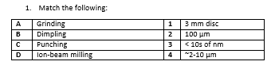

##  Post test
 
a.	A-1, B-2, C-3, D-4 		
b.	A-2, B-1, C-4, D-3 
c.	A-4, B-2, C-3, D-1 
<b>d.	A-2, B-4, C-1, D-3</b> 

2.Double side dimpling of sample has advantage of: 
a.	Providing very sharp and narrow region of observation 
<b>b.	Providing very shallow and wide region of observation</b> 
c.	Minimised sample damage 
d.	Easier sample handling  

3.The nano-sized powders may be observed under TEM by which technique: 
<b>a.	Using few drops of powder-suspension on carbon coated copper grid</b> 
b.	By conventional process of slicing, punching, dimpling, and ion beam milling 
c.	By putting nano-powders on copper grid 
d.	By making slurry/paste of powders on carbon coated copper grid  

4.The powder samples are suspended in the solution by: 
a)	Magnetic stirrer  
b)	Electric Heater 
c)	Gravity shaker  
<b>d)	Ultrasonication</b> 

5.A nanocrystalline powder material is usually supported on TEM holder for TEM imaging: 
a.	Using copper grid 
b.	Dispersing on carbon tape 
c.	as stand-alone sample 
<b>d.	On carbon coated copper grid</b>  

6.Brittle materials are prepared for TEM imaging using: 
<b>a.	Ion beam milling</b> 
b.	Electrochemical Etching 
c.	Physical Vapor deposition 
d.	Disc-slicing  

7.Double side dimpling is preferred over one-sided dimpling because: 
a.	Double side dimpling has double efficiency of operation 
b.	Double side dimpling promotes less damage to material 
<b>c.	Double side dimpling provides more observable area for imaging</b> 
d.	Double side dimpling reduces charging on the TEM sample

