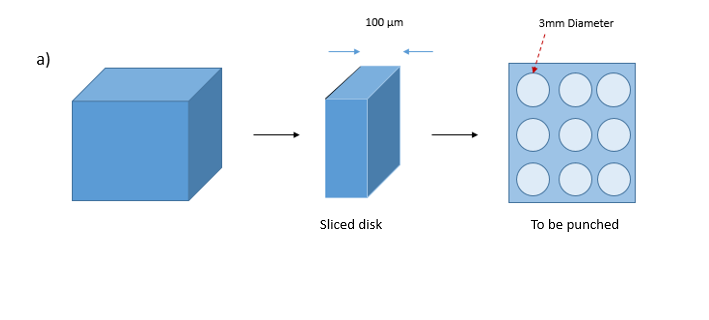
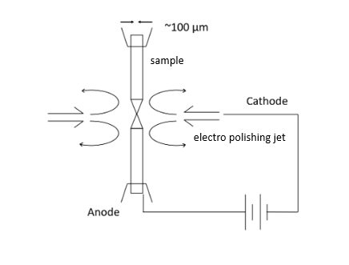
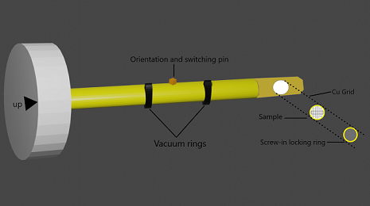

<b>TEM Sample Preparation:</b> 
<<<<<<< HEAD

For observation under transmission electron microscope, the sample has to be transparent to the electron (i.e. sample should be thin enough to allow transmission of electrons through the sample). Thicker samples will attenuate the electrons completely and will limit their detection on the other side of the surface. In addition, higher energy electron beam may work for thicker samples (say 0.5-1.0 µm samples), but will also damage the sample. In summary, the actual features of sample may get modified due to high-energy electron interaction with matter (during imaging itself). Thus, it is wiser to ensure that the sample preparation or beam energy does not modify the real features (which may otherwise lead to improper conclusions). Usually, the steps involved in TEM sample preparation from a bulk sample (Fig. 1a) include slicing (Fig. 1b), grinding to less than 100 µm (Fig. 1c),  punching a 3 mm disc (Fig. 1d)  disc, followed by dimpling (Fig. 1e) down to 2-10 µm, and ending with jet polishing and/or ion-beam milling (Fig. 1f).
 

<video width="320" height="240" controls>
  <source src="images/exp9-TEM_sample_prep_mod.mp4" type="video/mp4">
  Your browser does not support the video tag.
</video> Video on Sample Preparation for TEM analysis (Bulk metal, Powder sample, Brittle material)

 
  
 

Figure 1: The sample preparation involves using: a) the starting bulk sample, b) sectioning the sample to ~150-300 µm, c) Thinning it down to < 100 µm by grinding, d) punching a 3mm disc, followed by e) dimpling down to ~2-10 µm, and f) jet-polishing/ion-beam milling. 
=======
For observation under transmission electron microscope, the sample has to be transparent to the electron (i.e. sample should be thin enough to allow transmission of electrons through the sample). Thicker samples will attenuate the electrons completely and will limit their detection on the other side of the surface. In addition, higher energy electron beam may work for thicker samples (say 0.5-1.0 µm samples), but will also damage the sample. In summary, the actual features of sample may get modified due to high-energy electron interaction with matter (during imaging itself). Thus, it is wiser to ensure that the sample preparation or beam energy does not modify the real features (which may otherwise lead to improper conclusions). Usually, the steps involved in TEM sample preparation from a bulk sample (Fig. 1a) include slicing (Fig. 1b), grinding to less than 100 µm (Fig. 1c),  punching a 3 mm disc (Fig. 1d)  disc, followed by dimpling (Fig. 1e) down to 2-10 µm, and ending with jet polishing and/or ion-beam milling (Fig. 1f).  
 

 
Figure 1: The sample preparation involves using: a) the starting bulk sample, b) sectioning the sample to ~150-300 µm, c) Thinning it down to < 100 µm by grinding, d) punching a 3mm disc, followed by e) dimpling down to ~2-10 µm, and f) jet-polishing/ion-beam milling.  
>>>>>>> 9d95b0dfbf12ac480d2d9f2b6fb451baac6df83a
  
Step 1: The first step in TEM sample preparation is to slice/cut the material down to < 100 µm. The process of thinning can be achieved by sectioning the sample with slow speed diamond saw or ultrasonic cutter or electro-discharge cutting. As the starting material may be in bulk form (a few mm to cm in sample thickness), thinning process starts with sectioning the material using diamond saw to obtain a thin sample (which may usually have thickness exceeding > 150-250 µm). Now further processing is required for being able to make this material observable under TEM.

Step 2: Slicing is followed by grinding the surface to remove surface damage (induced during the sectioning process). The damage area is typically 2-5 times the blade thickness. Therefore, it is essential to utilise thinner blades at low speeds to minimize surface damage. Once the sample is sectioned (> 100 µm) , the damaged surface (from slicing) should be removed by grinding process (from using coarser to finer emery papers) till the  surface is prepared and brought down to thickness < 100 µm (say 50-75 µm). 
Step 3: Thereafter, usually, a few of 3 mm diameter samples are punched out of this sheet (using a punch machine). Punching out of 3 mm disc samples may also induce edge-damage, hence enough care is required for this step as well. Nonetheless, the sample is prepared for TEM imaging at center of the disc, hence some edge-damage can also be tolerated in this sample-preparation process. Further, multiple samples are prepared as only a few may provide the relevant information the user is looking for. Therefore, multiple samples are prepared for observation under TEM. 

Step 4: These punched out samples are now dimpled using dimpler (Fig. 2a). In this process a vertical grinding disc is utilised to remove the material from the center, while the sample itself is also rotated horizontally. By this process, a spherical cavity is produced in the center, while the edges remain thick (which are useful in sample handling). The dimpling process can be done on one surface (Fig. 2b) or both the surfaces (both top and bottom), Fig. 2c. A glue is utilised to stick the sample to a mount and then heated to remove the glue. The sample surface can be reversed for two-side dimpling (Fig. 2c). Though more tedious, the double-dimpling process provides wider area for sample observation. The thinning is performed till the sample become very thin (say ~ 2-5 µm thick).

<<<<<<< HEAD
  

 
 
Figure 2: a) TEM sample Dimpler showing that a vertical rotating grinder thins the TEM disc sample and the specimen itself rotates to provide a b) one-side dimple, or c) two-side dimple in the center of the sample. 
Step 5: Either electrochemical etching (for conducting samples) or ion beam milling (for all samples) may be utilised for the final sample preparation. In electropolishing, the electrolyte is sprayed (in jet form) on the sample until a through hole is created (using a through-light automatic detector). The immediate region around this through hole is actually a electron-transparent region which can be observed under TEM. Surface has to be immediately washed in order to remove any chemical, which may further damage the surface. If process goes unchecked, a bigger perforation (or multiple perforations) may form, which, again, will hinder the observation of microstructure and induce other imaging artefacts.  
Another way of preparing final sample for TEM observation is ion beam milling. This process utilises either a single or double ion mill, usually placed at ~ 6°incident angle from surface, to create a gradual removal of material in form of conical cavity. This process is very slow, but creates very good surface (with almost no surface damage) for TEM observation.  
=======
  
 
 
 
Figure 2: a) TEM sample Dimpler showing that a vertical rotating grinder thins the TEM disc sample and the specimen itself rotates to provide a b) one-side dimple, or c) two-side dimple in the center of the sample. 
Step 5: Either electrochemical etching (for conducting samples) or ion beam milling (for all samples) may be utilised for the final sample preparation. In electropolishing, the electrolyte is sprayed (in jet form) on the sample until a through hole is created (using a through-light automatic detector). The immediate region around this through hole is actually a electron-transparent region which can be observed under TEM. Surface has to be immediately washed in order to remove any chemical, which may further damage the surface. If process goes unchecked, a bigger perforation (or multiple perforations) may form, which, again, will hinder the observation of microstructure and induce other imaging artefacts.  
Another way of preparing final sample for TEM observation is ion beam milling. This process utilises either a single or double ion mill, usually placed at ~ 6°incident angle from surface, to create a gradual removal of material in form of conical cavity. This process is very slow, but creates very good surface (with almost no surface damage) for TEM observation.  
 
>>>>>>> 9d95b0dfbf12ac480d2d9f2b6fb451baac6df83a
Once the 3 mm diameter disc is ready (with a certain region transparent to electrons), this disc is placed in TEM holder. This TEM holder is inserted to reach the central region of TEM through which electron beam passes and the sample can be imaged. A low temperature is maintained near the sample (i.e. liquid nitrogen environment) to minimise any damage in the sample from electron beam.  
  
Notes: 
1.POWDER MATERIAL: 
Very fine nano-powders may be observed under TEM by first suspending the powders (say in ethanol) and releasing a few drops of solution on support film (or ‘carbon coated copper grid’ TEM grid). This support film is weaker, and the copper grid provides the required support to hold the particles. These films/grids are usually ~3 mm in diameter that sit comfortably on the TEM grid holder. Though the copper grid may have meshed regions that hide the observable region, but copper mesh makes the hold stronger and provides the required support. 
2.BULK MATERIAL (METALLIC): 
The process mentioned in the theory matches ideally for a metallic bulk material. The routine processes of slicing, punching, and dimpling followed by either or both of electrochemical etching and ion-beam milling may be adopted. The good point with electrochemical etching is that the process is fast, but may end up completely damaging the material (with multiple perforations and eating away the thin regions). On the other hand, ion-beam milling process is slow, but does not damage the surface and the quality of region for TEM imaging is very good. 
3.BRITTLE MATERIALS: 
Brittle materials may be crushed into fine powders, and then using above technique, can be observed under TEM. Ductile materials may undergo routine process of thinning and forming its disc that is transparent to electrons in the centre. As the brittle materials do not deform, its crushing into powder still retains the microstructural features. Thus, TEM can be effectively used to capture the microstructural features of brittle materials after milling it in powder form.  
<<<<<<< HEAD
In case the brittle materials are to be assessed in bulk form, the routine process of thinning into <100 µm sheet, then following the routine process of punching, and dimpling may be followed. Please note that the slicing (into regions of <100 µm thick) of brittle materials may be difficult, thus a brittle material is usually ground to make it thinner. Thinner sheets show some flexing nature (or compliance) and do not fail like bulk brittle materials. Now, the 3 mm punch can be made on these sheets, which follow the dimpling process. But, after than ion-beam milling may be adopted (instead of electrochemical etching, as the brittle materials are usually chemically inert). for obtaining the electron transparent region for observation 

<!--
=======
In case the brittle materials are to be assessed in bulk form, the routine process of thinning into <100 µm sheet, then following the routine process of punching, and dimpling may be followed. Please note that the slicing (into regions of <100 µm thick) of brittle materials may be difficult, thus a brittle material is usually ground to make it thinner. Thinner sheets show some flexing nature (or compliance) and do not fail like bulk brittle materials. Now, the 3 mm punch can be made on these sheets, which follow the dimpling process. But, after than ion-beam milling may be adopted (instead of electrochemical etching, as the brittle materials are usually chemically inert). for obtaining the electron transparent region for observation 
>>>>>>> 9d95b0dfbf12ac480d2d9f2b6fb451baac6df83a
<video width="320" height="240" controls>
  <source src="exp9-TEM_sample_prep_mod.mp4" type="video/mp4">
  Your browser does not support the video tag.
</video> Video on Sample Preparation for TEM analysis (Bulk metal, Powder sample, Brittle material)
<<<<<<< HEAD
-->
=======
>>>>>>> 9d95b0dfbf12ac480d2d9f2b6fb451baac6df83a
